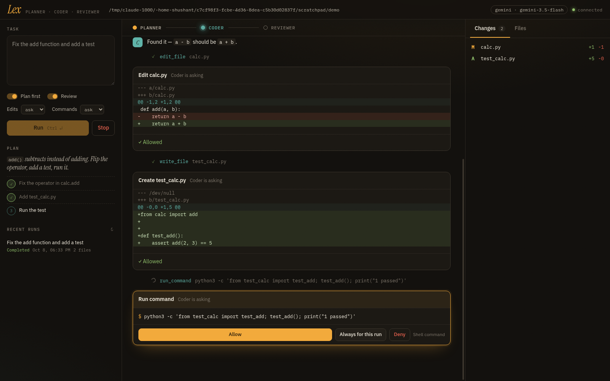

# Lex

A planner, a coder and a reviewer that work on your project together, from the terminal or a local web UI.



You describe a task. The **Planner** reads the project and writes a short plan. The **Coder** carries it out with real tools (read, search, edit, run commands). The **Reviewer** reads the diff and either approves it or sends it back with specific issues. You approve every file change and shell command unless you say otherwise.

## Install

```bash
git clone https://github.com/Shushant17711/AI-Agent-Lex.git
cd AI-Agent-Lex
pip install -e .          # Python 3.10+
```

Set a key (or put it in `.env`, see `.env.example`):

```bash
export GEMINI_API_KEY=...            # default provider: Gemini
# or any OpenAI-compatible endpoint (OpenAI, OpenRouter, Ollama, LM Studio, vLLM)
export LEX_PROVIDER=openai LEX_BASE_URL=http://localhost:11434/v1 LEX_MODEL=qwen3-coder
```

## Use

```bash
lex "fix the failing tests"          # run in the current directory
lex run -w ~/code/app "add a --json flag to the CLI"
lex ui                               # web UI at http://127.0.0.1:8765
lex history                          # past runs
lex show <run-id>                    # replay one
```

Useful flags: `--no-plan`, `--no-review`, `--auto-edit` (apply edits without asking), `-y` (edits and commands without asking), `--read-only`, `-v`.

## Safety

- Agents can only touch files inside the workspace. Path escapes and symlinks out are refused.
- Edits and commands need your approval by default. Destructive commands (`rm -rf`, `sudo`, `git push --force`, `curl … | sh`, …) always ask, even in auto mode.
- Commands run non-interactively with a timeout; the whole process group is killed on timeout or Stop.
- The web UI binds to localhost, needs the access token printed in your terminal, and checks the Host and Origin headers.

## Configuration

Precedence: defaults < `~/.config/lex/config.toml` < `<workspace>/lex.toml` < env vars < CLI flags.

```toml
provider = "gemini"
model = "gemini-3.5-flash"
approve_writes = "ask"     # ask | auto | deny
approve_commands = "ask"
max_turns = 40
review_rounds = 2
```

## Development

```bash
pip install -e '.[dev]'
pytest
```

Tests drive the full planner → coder → reviewer loop with a scripted provider, so no API key is needed.

## License

MIT. See [LICENSE](LICENSE).
